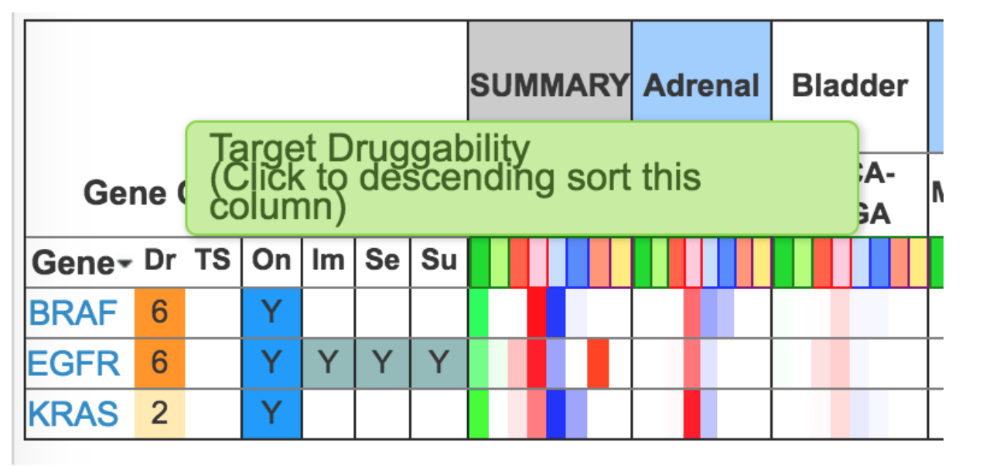

```{r libraries, results = "hide"}
library(FirebrowseR)
library(limma)
library(survival)
# etc.
```

In this homework, we are going to explore the data analysis of TCGA.

# Part I: Data from TCGA

Q1. Go to TCGA’s website
([https://cancergenome.nih.gov/](https://cancergenome.nih.gov/))) and
play with its data portal. How many *Glioblastoma Multiforme* (GBM)
cases in TCGA meet all of the following requirements?

1. Female;
2. Diagnosed at the age between 35 and 55;
3. Still alive.

Q2. TCGA GDC website
[https://portal.gdc.cancer.gov/](https://portal.gdc.cancer.gov/)
provides all raw data for downloading, while the Broad Firehose provides
analyses of interpreted and summarized data packaged in a form amenable
to immediate algorithmic analysis. Go to the FireBrowse portal
([http://firebrowse.org/](http://firebrowse.org/)), and download
clinical data for GBM. What's the average age at diagnosis of all GBM
patients?

```{r q2}
```

# Part II: Tumor Subtypes

You are given a number of TCGA glioblastoma (GBM) samples and 10
commercially available normal brains (it is unethical to take matched
normal brain from GBM tumor patients), including their expression, DNA
methylation, mutation profiles as well as patient survival. Please note
that we only selected a subset of the samples to make this HW, which
were simplified to give students a flavor of cancer genomics studies, so
some findings from these data might not reflect the real biology of GBM.

Q3. The expression data(GBM\_expr.txt) is in Affymetrix microarray
format. Find the differential genes between cancer and normal. How many
genes do you get?

```{r q3}
gbm_expr <- read.table("data/GBM_expr.txt")
```

Q4. Find 1000 genes with the biggest variation in gene expression from
all the samples (cancer and normal). What's the 1000th gene?

```{r q4}
```

Q5. Do a K-means (k=3) clustering from all the expression profiles,
differential genes (Q3), and more variable genes (Q4). Do cancer and
normal separate in different clusters? Do the cancer samples
consistently separate into 2 clusters, regardless of the genes you
use?

```{r q5}
set.seed(20180410)
```

Q6. How many genes are differentially expressed between the two GBM
subtypes (with FDR $< 0.05$ and logFC $> 1.5$?

```{r q6}
```

Q7. **For Graduate Students**: From the DNA methylation
profiles(GBM\_meth.txt), what are the genes significantly differentially
methylated between the two subtypes? How many differentially expressed
genes have an epigenetic (DNA methylation) cause?

```{r q7}
gbm_meth <- read.table("data/GBM_meth.txt")
# logit transformation
gbm_meth <- as.data.frame(qlogis(as.matrix(gbm_meth)))
```

# Part III: Survival analysis

Q8. With the survival data of the GBM tumors (GBM\_clin.txt), make a
Kaplan-Meier Curve to compare the two subtypes of GBM patients. Is there
a significant difference in patient outcome between the two subtypes?

```{r q8}
gbm_clin <- read.table("data/GBM_clin.txt")
rownames(gbm_clin) <- gsub("-", ".", rownames(gbm_clin))
```

Q9. Use the differential genes between the two GBM subtypes (Q6) as a
gene signature to do a Cox regression of all the samples. Try two
different FDR and logFC cutoff settings (e.g. FDR $< 0.03$, logFC $>
2$). Do these gene signatures give significant predictive power of
patient outcome?

```{r q9}
```

Q10. **For Graduate Students**: Many studies use gene signatures to
predict prognosis of patients. Take a look at this paper:
[http://journals.plos.org/ploscompbiol/article?id=10.1371/journal.pcbi.1002240](http://journals.plos.org/ploscompbiol/article?id=10.1371/journal.pcbi.1002240)

It turns out that most published gene signatures are not significantly
more associated with outcome than random predictors.

Write a script to randomly sample Y genes in this expression data as a
gene signature and do Cox regression on the sampled signature to predict
patient outcome. Automate the script and random sample followed by Cox
regression 100 times. How does your signature in Q9 compared to random
signatures in predicting outcome?

```{r q10}
set.seed(20180410)
```

# Part IV: Mutation analysis

Q11. The MAF files contain the mutations of each tumor compared to the
normal DNA in the patient blood. Write a python program to parse out the
mutations present in each tumor sample, and write out a table. Rank the
mutations by how many times the specific mutation happens in the tumor
samples provided, and submit the table with the top 20 mutations.

Q12. Are there any mutations that are specifically enriched in one
subtype of GBM over the other?

Q13. Go to cBioPortal
([http://www.cbioportal.org](http://www.cbioportal.org)). Input each
gene in Q12, and click Submit. You can see how often each gene is
mutated in all TCGA cancer types. Based on this, which of the genes in
Q12 is likely a cancer driver gene?

Q14. From the mutation tab on the cBioPortal result page, is this
mutation a gain or loss of function mutation on the gene you identified
from Q13?

# Part V: Precision Medicine

A loved one was recently diagnosed with GBM, and from exome-seq of the
tumor you identified the top mutation in Q12. You wonder whether there
are drugs that can target this mutation to treat the cancer.

Q15. Go to
[https://www.clinicaltrials.gov](https://www.clinicaltrials.gov) to find
clinical trials that target the gene in Q12. How many trials are related
to glioblastoma or glioma? How many of these are actively recruiting
patients which your loved one could potentially join? (Hint: search the
disease name with gene name)

# Part VI: CRISPR Screens

We will learn to analyze CRISPR screen data from this paper:
[https://www.ncbi.nlm.nih.gov/pubmed/?term=26673326](https://www.ncbi.nlm.nih.gov/pubmed/?term=26673326).
To identify therapeutic targets for glioblastoma (GBM), the author
performed genome-wide CRISPR-Cas9 knockout (KO) screens in
patient-derived GBM stem-like cell line (GSCs0131).

MAGeCK tutorial:

+ [https://sourceforge.net/p/mageck/wiki/Home/](https://sourceforge.net/p/mageck/wiki/Home/)
+ [https://sourceforge.net/projects/mageck/](https://sourceforge.net/projects/mageck/)

Q16. Use MAGeCK to do a basic QC of the CRISPR screen data (e.g. read
mapping, ribosomal gene selection, replicate consistency, etc).

Q17. Analyze CRISPR screen data with MAGeCK to identify positive and
negative selection genes. How many genes are selected as positive or
negative selection genes? Which pathways are enriched for positive and
negative selection genes separately?

Q18. **For Graduate students**: Genes uniquely negatively selected in
the GBM cell lines compared to many other cell lines could be potential
drug targets for GBM. For the negatively selected genes, filter out
those that are pan essential (PanEssential.txt). Take the remaining top
10 genes, and check whether those genes have drugs or are druggable from
this website:
[http://www.oasis-genomics.org/](http://www.oasis-genomics.org/). Go to
Analysis $\rightarrow$ Pan Cancer Report, type the top genes and check
the following table for druggability.


