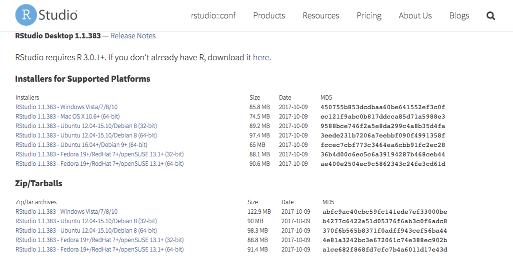
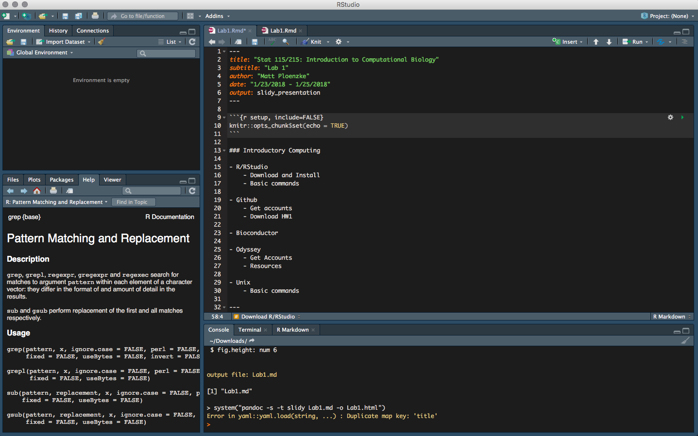
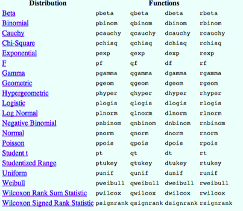

```{r setup, include=FALSE}
knitr::opts_chunk$set(echo = TRUE)
```

### Introductory Computing

- R/RStudio
    - Download and Install
    - Basic commands

- Github
    - Get accounts
    - Download Lab 1

- Bioconductor

- Odyssey
    - Get Accounts
    - Resources

- Unix
    - Basic commands
    
---

### Introductory Computing

- python (next time)

- RMA and Limma

- HW1 questions (due Sunday 2/4)

---

#### Intro to R

This is an R Markdown document that I have output to an HTML presentation. Markdown is a simple formatting syntax for producing HTML, PDF, and MS Word documents. For more details on using R Markdown see <http://rmarkdown.rstudio.com>.

Each homework will be completed in this format and you will submit both the markdown document with code (.Rmd) and the compiled document (.html or .pdf). With this format all necessary code (including python code!) may be included in one source and the graders may easily reproduce your results.

Homework files will be provided in several sources depending on thir type/size. Canvas will contain the problem sets and you will submit your completed homework here. GitHub will also contain the problem sets as well as necessary (small) datasets, etc. The Odyssey cluster will contain larger datafiles (/n/stat115/) and will be necessary for high performance computing later in the semester.

But first, let's get R/RStudio downloaded!

---

#### Download R/RStudio



---

```{r, out.width = "900px", echo=FALSE}

```

---

Before we get into knitting, let's consider the concept of a working directory.

```{r, eval=FALSE, echo=TRUE}
# where am I
getwd()

# change where I am
setwd("~/Downloads/")

# list all files
dir()

# list all variables
ls()
```

---

We often want to install packages to add some extra functionality on top of base R (https://cran.r-project.org/). To do so, we need to know the name of the package (often found via a google search) and we need to install it. Once installed, we need to load the package into the namespace. 

Let's try to install the `rmarkdown` package.

```{r, eval=FALSE,echo=TRUE}
install.packages("rmarkdown")
library(rmarkdown)
```

Now make sure to open the markdown document and follow along! Download either from canvas or from (https://github.com/stat115/Lab1).

---

#### Quick GitHub Detour

GitHub is a version control system that we will be using primarily as a repository for the homeworks and labs. It is a great tool and we recommend learning and utilizing GitHub for your own work. Lots of tutorials are available such as (https://guides.github.com/activities/hello-world/). 

You will only be required to download the homework files and labs but there are many more features worth learning (commiting, branching, etc.). But first, let's download the lab files.

---

#### Quick GitHub Detour

- First, register for an account (https://github.com/join)
    - Students get some great extras free for two years as well (https://education.github.com).

- Navigate to the stat115 github page (https://github.com/stat115/)

- Click on the Lab 1 repository

- Click the "Clone or download" button.
    - Either Download Zip and open in finder/explorer. Open in RStudio.
    - Alternatively, copy the URL to the clipboard (https://github.com/stat115/Lab1.git). Switch to RStudio. Click the "Project (None)" button in the near the top menu bar. Click "New Project", "Version Control", "Git", then paste the URL into the first box.
    - Third option, download from Canvas and open/save as a new R markdown file (.Rmd).

- Now this will open up a stylized coding window. Please scroll to $\approx$ line 120

---

#### R Markdown

To submit your homework you will need to knit the homeowkr .Rmd file and submit both the PDF and the code. 

When you click the **Knit** button a document will be generated that includes both content as well as the output of any embedded R code chunks within the document. You can embed an R code chunk like this:

```{r}
# we can adjust the size of the text
# Big
## Kinda big
### Still biggish
#### Pretty Normal
```

You can also **bold** or *italicize* text easily. LaTex code may be added inline, such as $\sum_{i=1}^{N}$, as well as inline `code`. Images are very easy to display as well (see above). To suppress code, name chunks, etc. we need to specify the option to the R code chunk. Note that `echo=FALSE` may be added and the code chunk will not be shown at all.

```{r section_name, eval=FALSE}
# sample code block
```

---

#### R Markdown

You can also embed plots, for example:

```{r fig.width=7, fig.height=6}
plot(cars)
```

---

#### R Markdown

A great cheatsheet is available [here](https://www.rstudio.com/wp-content/uploads/2015/02/rmarkdown-cheatsheet.pdf).

---

#### Intro to  R

Now we will go over basic R commands.

```{r, eval=FALSE}
save(x,file=“name.RData”) # save specific objects to current working directory
save.image(“name.Rdata”) # save the whole workspace

load(“name.Rdata”) # load what we saved

?lm # use single ? for function documentation
??lm # use double ? to query related functions
```

---

#### R Objects

- Almost all things in R are objects
    - Functions, datasets, results, plots in ggplot (not plots in base R)
    
- Objects are classified by two criteria
    - Mode: How objects are stored in R
        - Character, numeric, logical, factor, list, function...
        - To obtain the mode of an object `mode(object) `
    - Class: How objects are treated by functions
        - Vector, matrix, array, data.frame,... 
        - To obtain the class of an object `class(object) `

---

#### R Objects

We can make variable assignments as follows:

```{r}
assembly <- "hg19" # character
class(assembly)

expression <- 3.456 # numeric
class(expression)

nbases <- as.integer(3000000) # integer
class(nbases)

completed <- FALSE # logical
class(completed)
```

---

#### R Vectors

```{r}
x <- c(1,2,3,4,5) # R is a vectorized language
print(x[1])

y <- c(x^2,x,sqrt(x)) # Operations are performed to each element
print(y)

z <- x + y # Not all vectors are the same length
print(z)

x <- x<3 # Vectors may be logical as well
print(x)
```

---

#### R Lists

Lists generalize vectors to store varying lengths and types. You need to be careful when accessing the elements.

```{r}
x1 <- 1:5
x2 <- c(T,T,F,T,F)
y <- list(question.number = x1, question.answer = x2) 
print(y[[1]]) # Access the first list entry
print(y[[2]][2]) # Access the second number of the second list entry
```

---

#### R Matrices

```{r}
y <- matrix(1:8,nrow=2,ncol=4,byrow=FALSE) # Create a 2x4 matrix
y[1,2] # Access first row second column
y[,2] # Access the second column
dim(y) # Size of y
y %*% t(y) # Matrix multiplication
```

---

#### R Matrices

```{r}
cbind(y,seq(5,6)) # Add a column
rbind(y,1:4) # Add a row
apply(y,2,mean) # Apply function mean over columns
library(matrixStats)
rowMeans(y) # Or use a package!
```

---

#### R Data Frames

```{r}
policy.number <- c("A00187", "A00300","A00467","A01226")
issue.age <- c(74,30,68,74)
sex <- c("F", "M", "M", "F")
smoke <- c("S","N","N","N")
face.amount <- c(420, 1560, 960, 1190)
ins.df <- data.frame(policy.number, issue.age, sex, smoke, face.amount) # Create it

ins.df[1,] # access first row
ins.df[,1] # access first column
ins.df$policy.number # access policy number column
rownames(ins.df) # row names
colnames(ins.df) # column names
index.smokers <- which(ins.df$smoke == "S") # row index of smokers 
ins.df[index.smokers] # access all smokers in the df
ins.df$policy.number[index.smokers] # policy number for smokers
```

--- 

#### Loops and Conditionals

```{r}
a <- 9
for (i in 1:a) {
  if (i < 5) {
    print(i)
  } else {
    next()
  }
}
```

You can also use a `while` loop although this is less common.

---

#### User Functions

```{r}
my.function <- function(y,z,...) {
  y <- log(y)*z-z^3+z^2
  plot(z,y,...)
}
my.function(1:10,21:30,type="l",col="red")
```

---

#### Data Input/Output

Reading from files to a data frame

```{r,eval=FALSE}
read.csv(“filename.csv“) # reads csv files into a data.frame
read.table(“filename.txt“) # reads txt files in a table format to a data.frame
```

Writing from a data frame to a file

```{r,eval=FALSE}
write(x,filename) # writes the object x to filename
write.table(x,filename) # writes the object x to filename in a table format
```

Keep in mind additional options such as, `header = TRUE, row.names = TRUE, col.names = TRUE, quotes = TRUE`, etc.

---

#### Plotting in base R

```{r}
x.data=rnorm(1000)
y.data=x.data^3-10*x.data^2
z.data=-0.5*y.data-90

plot(x.data,y.data,main="Title of the graph",xlab="x label",ylab="y label") # call plot
points(x.data,z.data,col="red") # add points
legend(-2,2,legend=c("Black points","Red points"),col=c("black","red"),pch=1,text.col=c("bl ack","red")) # add legend
```

Check out ggplot2 for much prettier plots. Not required but highly recommended. See [tutorial](http://tutorials.iq.harvard.edu/R/Rgraphics/Rgraphics.html).
```{r}
#install.packages("ggplot2")
#library(ggplot2)
```

---

#### Sampling Distributions

```{r}
sample(1:10,size=5,replace=TRUE) # sample 5 numbers 1-10 with replacement
```

Or use statistical distributions



---

#### Bioconductor

We already discussed how to install and load libraries coming from CRAN. However, often we will want to install packages from other sources. In computational biology, many of these will come from [Bioconductor](www.bioconductor.org).

The process is much the same, but now we need to tell R to look in there instead of a CRAN mirror.

```{r,eval=FALSE}
source("http://bioconductor.org/biocLite.R") 
biocLite("affy")
```

Once it's been downloaded we can simply load it via the library call.

```{r}
library(affy)
```

---

#### GitHub

Similarly, to download packages from GitHub use:

```{r,eval=FALSE}
install.packages("devtools")
devtools::install_github("hadley/dplyr")
```

Note the `::` is a reference to the `devtools` namespace. We could have also done 
```{r, eval=FALSE}
library(devtools)
install_github("hadley/dplyr")
```

---

#### Odyssey

Harvard FAS offers students access to the [Odyssey High Performance Computing Cluster](https://www.rc.fas.harvard.edu/resources/). Executing code on the cluster is necessary as our laptops are unable to do many of the computation-intensive bioinformatics pipelines. 

You should have completed [this form](https://goo.gl/forms/WM19bYn9lQYYBPh93) in class to request access to the cluster. You will need to complete the mandatory online training and follow the [directions](https://www.rc.fas.harvard.edu/resources/odyssey-quickstart-guide/) for setting up your account. 

Mac users will be able to use the Terminal application but Windows users may need to install Putty (or some other Unix terminal application) to communicate with the cluster. You will also need to download the two-factor authentication [OpenAuth](https://www.rc.fas.harvard.edu/resources/documentation/openauth/) and may want to download [Filezilla](https://www.rc.fas.harvard.edu/resources/documentation/sftp-file-transfer/) to transfer files. 

We will be going over basic Odyssey use and Unix commands.

---

#### Unix Basic Commands

```{r, engine="bash"}
pwd # print working directory
ls -l # list files in current working directory
cd ~/Downloads # change directory
```


```{r, engine="bash", eval=FALSE}
mkdir temp_dir # make a directory
cd temp_dir # move forwards
cd .. # move backwords
history # see command history
history | grep mkdir # filter command history for a specific keyword
```

---

#### Unix Basic Commands

```{r, engine="bash"}
echo 'Hello, world.' > foo.txt # create a one-line file
head foo.txt # view top lines of file
cp foo.txt foo2.txt # copy file
mv foo2.txt ../foo.txt # move file backwards
rm foo.txt ../foo.txt # delete files
```

---

#### Odyssey Basic Commands

```{r, engine="bash",eval=FALSE}
ssh ploenzke@login.rc.fas.harvard.edu # log on to cluster
module-query STAR # check which software is available
module load gcc/4.8.2-fasrc01 STAR/2.5.0c-fasrc02
```

---

#### Odyssey Basic Commands

```{r, engine="bash",eval=FALSE}
#!/bin/bash 
#SBATCH -n 10 #Number of cores 
#SBATCH -t 1440  #Runtime in minutes 
#SBATCH -p general      #Partition
#SBATCH --contiguous    #Cores on same infiniband switch
#SBATCH --mem=60000    #Total memory
#SBATCH --mail-type=END # Email
#SBATCH --mail-user=ploenzke@g.harvard.edu
```

```{r, engine="bash",eval=FALSE}
sbatch file.sh # run job
squeue # check on job
sacct # all jobs ran today
scancel jobid # kill job
```

---

#### Odyssey Information

Please check the course site (files/labs/01/) for a detailed introduction to Odyssey.
