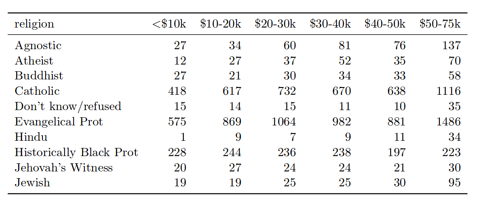
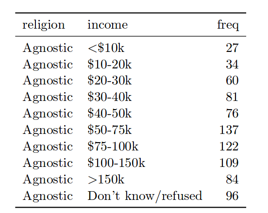

```{r setup, include=FALSE}
knitr::opts_chunk$set(echo = TRUE, fig.align = "center")
```


## Outline of Lab

1. `data.table`: Easier way to manipulate data
2. Joins
3. Tidy data
4. Adding text to plots


## Install and Load Packages

```{r install, eval = FALSE}
install.packages("data.table")
install.packages("ggplot2")
install.packages("ggrepel")
install.packages("tidyr")
# etc.
```

```{r libraries, warning = FALSE, message = FALSE}
library(data.table)
library(ggplot2)
library(ggrepel)
library(tidyr)
```


## data.table Introduction

+ Data science (and bioinformatics!) is 80% data cleaning, 20% analysis.
+ Make the data cleaning part as painless as possible.
+ An enhanced version of R's built-in `data.frame`.
+ General form of syntax: `DT[i, j, by]`
+ Material adapted from `data.table` vignette: https://cran.r-project.org/web/packages/data.table/vignettes/datatable-intro.html


## Data

+ NYC flights from 2014
```{r loaddata}
DT = data.table(ID = c("b","b","b","a","a","c"), a = 1:6, b = 7:12, c = 13:18)
DT
flights <- fread("https://raw.githubusercontent.com/wiki/arunsrinivasan/flights/NYCflights14/flights14.csv")
head(flights)
```


## Subsetting

+ Focus on i and j for `DT[i, j, by]`
+ `i` controls the rows
+ `j` controls the columns

```{r}
ans <- flights[origin == "JFK" & month == 6,]
head(ans)

ans <- flights[, arr_delay]
head(ans)

ans <- flights[, .(arr_delay, dep_delay)]
head(ans)
```


## Compute in j

+ Can use the columns to compute specific values.
+ Find flights that had total delay < 0

```{r}
ans <- flights[, sum((arr_delay + dep_delay) < 0)]
ans
```

+ Get mean arrival and departure delays for flights leaving JFK in June.
```{r}
ans <- flights[origin == "JFK" & month == 6,
               .(m_arr = mean(arr_delay), m_dep = mean(dep_delay))]
ans
```

+ Get number of flights leaving JFK in June.
+ `.N` is special variable from `data.table`.
```{r}
ans <- flights[origin == "JFK" & month == 6, .N]
ans
```


## Selecting using names

+ Previously, didn't have to quote the column names
+ You can also use quoted column names using `with = FALSE`.
```{r}
ans <- flights[, c("arr_delay", "dep_delay"), with = FALSE]
head(ans)

# returns all columns except arr_delay and dep_delay
ans <- flights[, !c("arr_delay", "dep_delay"), with = FALSE]
head(ans)
# or
ans <- flights[, -c("arr_delay", "dep_delay"), with = FALSE]
head(ans)
```


## Aggregation

+ `DT[i, j, by]`: by allows us to aggregate.
+ Number of flights from each of the 3 NYC airports
```{r}
ans <- flights[, .(.N), by = .(origin)]
ans
```


+ Number of flights from each of the 3 NYC airports on American Airlines
```{r}
ans <- flights[carrier == "AA", .N, by = origin]
ans
```

+ Number of flights on American Airlines, grouped by origin and destination
```{r}
ans <- flights[carrier == "AA", .N, by = .(origin, dest)]
head(ans)
```

+ Mean arrival and departure delay for American Airlines, by route and month
```{r}
ans <- flights[carrier == "AA",
        .(m_arr = mean(arr_delay), m_dep = mean(dep_delay)),
        by = .(origin, dest, month)]
head(ans)
```

+ Number of flights departing and arriving late, departing early and arriving late, etc.
```{r}
ans <- flights[, .N, .(dep_delay>0, arr_delay>0)]
ans
```


## .SD and .SDcols

+ What if I want to take the mean of several variables?
+ By default, `.SD` holds all the columns except the ones in `by`
+ Can specify what `.SD` is using `.SDcols`.

```{r}
flights[carrier == "AA",                       ## Only on trips with carrier "AA"
        lapply(.SD, mean),                     ## compute the mean
        by = .(origin, dest, month),           ## for every 'origin,dest,month'
        .SDcols = c("arr_delay", "dep_delay")] ## for just those specified in .SDcols
```


## Working with References

+ In older versions of R (before 3.1), (1) would generate a deep copy
of the data. Fixed in later versions, but a deep copy is still created in (2).
+ These copies take up time/memory.
+ `data.table` avoids this by working with references.

```{r}
DF = data.frame(ID = c("b","b","b","a","a","c"), a = 1:6, b = 7:12, c = 13:18)
DF
DF$c <- 18:13                 # (1)
DF$c[DF$ID == "b"] <- 15:13   # (2)
```


## Assignment by Reference Using :=
+ Basic Syntax
```{r, eval = FALSE}
DT[, c("colA", "colB", ...) := list(valA, valB, ...)]

# when you have only one column to assign to you
# can drop the quotes and list(), for convenience
DT[, colA := valA]

# or

# valA is assigned to colA
# valB is assigned to colB
DT[, `:=`(colA = valA, 
          colB = valB,
          ...
)]
```
+ Example: calculate speed in mph and total delay
```{r}
flights[, `:=`(speed = distance / (air_time/60),
               delay = arr_delay + dep_delay)]
head(flights)
```


## Sub-Assigning

+ Notice there are 0 and 24. Let's get rid of 24 and set it to 0.
```{r}
flights[, sort(unique(hour))]
```

+ This will do it by reference. No copies made.
```{r}
flights[hour == 24, hour := 0]
flights[, sort(unique(hour))]
```


## Delete a Column

```{r}
flights[, c("delay") := NULL]
# equivalent to flights[, delay := NULL] since we just have 1 variable
```


## Assignment with Grouping Using := and by

+ Get max speed for each set of routes
+ Can be used to compare a particular flight's speed to the max speed
on that route.
```{r}
flights[, max_speed := max(speed), by = .(origin, dest)]
head(flights)
```

+ Get the max arrival and departure delays.
+ Can be used to compare a particular flight's delays to the max delay
on that route.
```{r}
in_cols  = c("dep_delay", "arr_delay")
out_cols = c("max_dep_delay", "max_arr_delay")
flights[, c(out_cols) := lapply(.SD, max), by = month, .SDcols = in_cols]
head(flights)

```


## Joining

+ Combining information from multiple sources.
+ 4 main kinds of joins:
    - Inner join
    - Left outer join
    - Right outer join
    - Full outer join
+ Can use `merge()` in R, which works with `data.table`'s and `data.frame`'s.
+ Can use `pandas` package in Python.
+ Ex: matching employees to their department name and manager.


```{r}
Employees <- data.table(employee_id = 1:6,
                        name = c("Alice", "Bob", "Carla", "Dan", "Eva", "Fred"),
                        department = c(11, 11, 12, 12, 13, 21),
                        salary = c(800, 600, 900, 100, 800, 700))
Employees
Departments <- data.table(department = c(11, 12, 13, 14),
                          department_name = c("Production", "Sales",
                                              "Marketing", "Research"),
                          manager = c(1, 4, 5, NA))
Departments
```


## Inner Join


```{r}
merge(Employees, Departments, all = FALSE, by = "department")
```

+ Only includes rows which have a `department` in both datasets.
+ Fred not included because his department, 21, is not in the departments table.


## Left Outer Join


```{r}
merge(Employees, Departments, all.x = TRUE, by = "department")
```
+ Only includes rows which have a `department` in the Employees dataset.
+ Fred is now included.
+ The research department, which has no people, is not included.


## Right Outer Join


```{r}
merge(Employees, Departments, all.y = TRUE, by = "department")
```

+ Only includes rows which have a `department` in the Departments dataset.
+ Fred is now excluded.
+ The research department, which has no people, is now included.


## Full Outer Join


```{r}
merge(Employees, Departments, all = TRUE, by = "department")
```

+ Include all rows.
+ Fred and Research both present.


## Tidy Data

+ "Happy families are all alike; every unhappy family is unhappy in its own way"
+ Tidy datasets are all alike but every messy dataset is messy in its own way.
+ Principles:
1.  Each variable forms a column.
2.  Each observation forms a row.
3.  Each type of observational unit forms a table
+ More info: http://vita.had.co.nz/papers/tidy-data.pdf


## Example




## Example




## How to deal with in R

+ Want to show the price of different stocks over time.
+ Use the `gather` command from the `tidyr` package.
```{r}
stocks <- data.frame(
  time = as.Date('2009-01-01') + 0:9,
  A = rnorm(10, 0, 1.5),
  B = rnorm(10, 0, 2.5),
  X = rnorm(10, 0, 1),
  Y = rnorm(10, 0, 2),
  Z = rnorm(10, 0, 4)
)
head(stocks)
# exclude time
# every other column will be transformed.
stocks2 <- gather(stocks, key = "stock", value = "price", -time)
head(stocks2)
ggplot(stocks2, aes(x = time, y = price, color = stock)) + geom_line()

```


## Cool way to put text in plots

+ May find this useful to label plots.
+ https://github.com/slowkow/ggrepel

```{r, fig.width = 12}
library(ggrepel)
library(cowplot) # for grid
set.seed(42)

#dat <- subset(mtcars, wt > 2.75 & wt < 3.45)
mtcars_dt <- data.table(mtcars)
mtcars_dt[, car := rownames(mtcars)]
# subset cars with 2.75 < wt < 3.45
dat <- mtcars_dt[wt > 2.75 & wt < 4.45,]
head(dat)

p <- ggplot(dat, aes(wt, mpg, label = car)) + geom_point(color = 'red')

p1 <- p + geom_text() + ggtitle("geom_text")
p2 <- p + geom_text_repel() + ggtitle("geom_text_repel")
plot_grid(p1, p2, nrow = 1)
```
