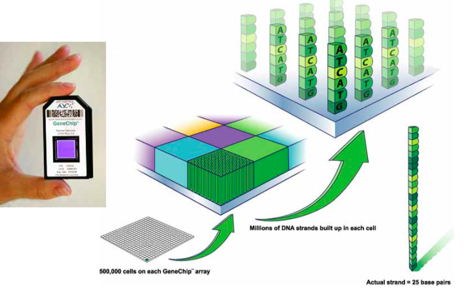
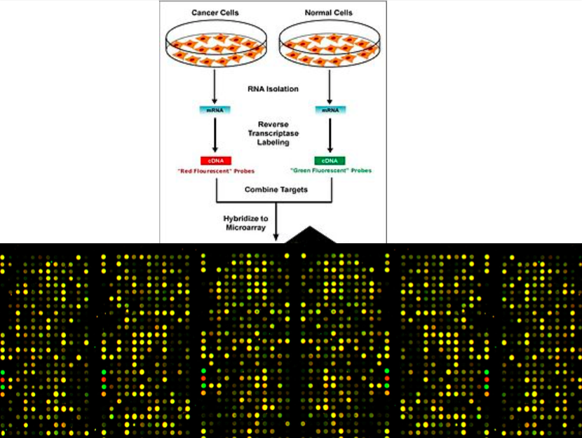
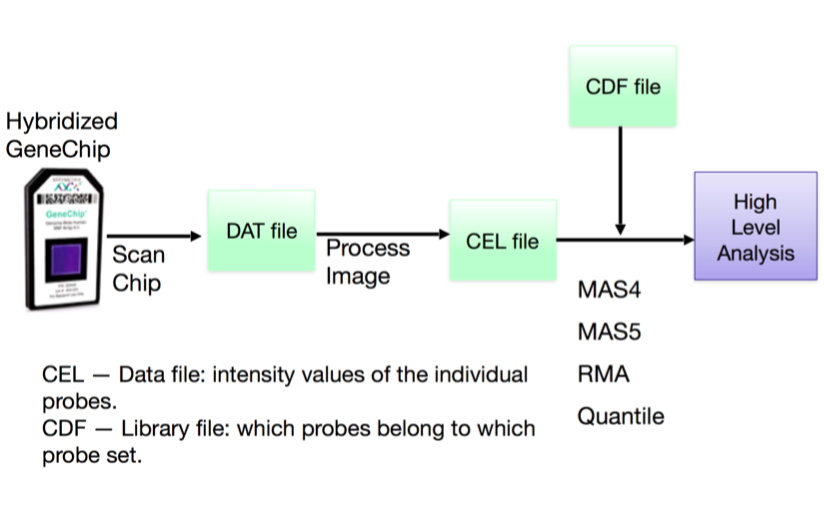
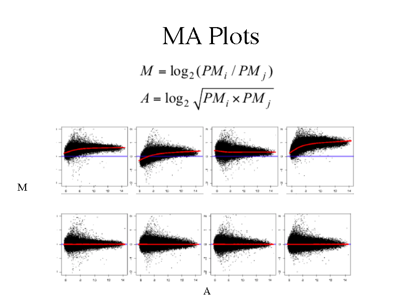
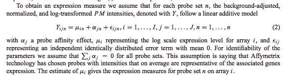
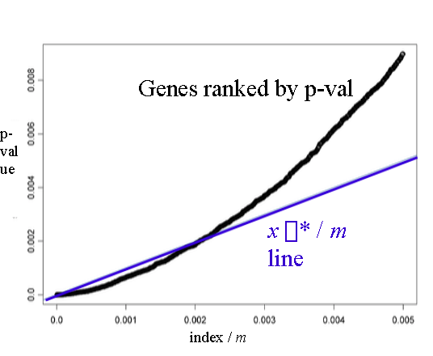

```{r setup, include=FALSE}
knitr::opts_chunk$set(echo = TRUE)
```

---

```{r, out.width = "1000px",echo=FALSE}

```

---

```{r, out.width = "1000px",echo=FALSE}

```

---

```{r, out.width = "1000px",echo=FALSE}

```

---

```{r, out.width = "1000px",echo=FALSE}

```

---

### [RMA](https://academic.oup.com/biostatistics/article/4/2/249/245074)

- Background correction
    - PM =  Signal + Background
    - Background estimated from Normal distribution of MM on each probe separately
    - Exponential distribution imposed upon Signal to provide closed-form solution & feasibility
    
- Quantile normalization

- Summarize pobe intensities
    - Denote background-adjusted, normalized, and log-transformed PM intensities = Y
    - Fit linear model Y = Sample effect + Probe effect + Noise
    - Robust to outliers: Parameters estimated through median polish
    
    
---

### [RMA](https://academic.oup.com/biostatistics/article/4/2/249/245074)

```{r, out.width = "1000px",echo=FALSE}

```

---

### Calling differentially expressed genes

- Given the expression level for each array-gene, how to call differentially expressed genes?

    - t-test to obtain p-values if normal (use QQ-plot to check)

    - Wilcoxon rank sum test (non-parametric) if non-normal
    
    - Linear modelling approach (limma)
        - Small number of replicates results -> difficult to estimate variance
        - Shrink variance through emperical bayes approach (pooling across genes)
        
- Use p-values obtained to call DE genes

---

### Multiple hypothesis testing

- Performed many, many statistical tests and so the normal significance threshold is too high

- Need a lower cutoff to control Type I error and FDR

- Simple Bonferroni correction too conservative (may lose out on calling DE genes)

- Benjamini-Hochberg method the most common

---

```{r, out.width = "800px",echo=FALSE}

```

---

### False Discovery Rate (FDR)

- Very useful concept in genomics studies

- P-value, FDR, q-value are monotonic

- Common FDR thresholds are 1%, 5%, and 10%

- Typically 500-2000 expressed genes 

- Active area of research with lots of methods being developed!

---

Download annotation data to map probe set to gene
```{r bioc, eval=FALSE}
## try http:// if https:// URLs are not supported
source("https://bioconductor.org/biocLite.R")
biocLite("affy")
biocLite("hgu133plus2.db")
biocLite("drosophila2.db")
```

```{r loadLibraries, message=FALSE, warning=FALSE, eval=FALSE}
library(knitr)
library(affy)
library(hgu133plus2.db)
library(drosophila2.db)
```

---

Load and view .CEL files
```{r loadData, eval = FALSE}
celFiles <- list.celfiles(path = "data", full.names=TRUE)
data.affy <- ReadAffy(filenames = celFiles)
data.affy
```

Show an MA Plot and other low-level plots
```{r MAplot, eval = FALSE}
MAplot(data.affy, pairs = TRUE, which=c(1,2,3,4), plot.method = "smoothScatter") #MA plot
image(data.affy) #array image
hist(data.affy) #log intensity density
boxplot(data.affy, col=c(1:4))
```

---

Normalize data with RMA
```{r, eval = FALSE}
data.rma <- rma(data.affy)
expr.rma <- exprs(data.rma) # format as table
```

```{r, eval = FALSE}
library(affyPLM) #compare normalized data with raw data
MAplot(data.rma, pairs = TRUE, which=c(1,2,3,4), plot.method = "smoothScatter")
boxplot(data.frame(expr.rma), col=c(1:4))
```

---

Viewing the gene names
```{r, eval = FALSE}
head(rownames(expr.rma), 20)
```

```{r, eval = FALSE}
# Convert gene names
Annot <- data.frame(REFSEQ=sapply(contents(drosophila2REFSEQ), paste, collapse=", "),
                    SYMBOL=sapply(contents(drosophila2SYMBOL), paste, collapse=", "),
                    DESC = sapply(contents(drosophila2GENENAME), paste, collapse=", ")  )

# Merge data frames together (like a database table join)
all <- merge(Annot, expr.rma, by.x=0, by.y=0, all = TRUE)
```

---

Finding significant up- and down-regulated genes
```{r, eval = FALSE}
control <- c(1,2)
mutants <- c(3,4)

foldchange <- apply(expr.rma, 1, function(x) mean( x[mutants] ) - mean( x[control] ) ) # fold change for each gene
T.p.value <- apply(expr.rma, 1, function(x) t.test( x[mutants], x[control], var.equal = TRUE)$p.value ) # t-test p-values
fdr <- p.adjust(T.p.value, method="fdr") # calculate FDR
```

---

```{r, eval = FALSE}
genes.up <- all$SYMBOL[ which( T.p.value < 0.05 & foldchange > 0 ) ] # filter to significantly up-regulated
genes.down <- all$SYMBOL[ which( T.p.value < 0.05 & foldchange < 0 ) ] #... down regulated
```

---

Alternatively, use a modelling approach:
```{r, eval = FALSE}
# Use limma to call differentially expressed genes
library(limma)
design <- c(0, 0, 1, 1) # assign control and trt groups
design.mat <- model.matrix(~design) 
fit <- lmFit(expr.rma, design.mat)
fit <- eBayes(fit)
topTable(fit, coef = "design",number=15) 
```

---

Two-factor design:
```{r, eval = FALSE}
design = c("WT.U", "WT.S", "Mu.U", "Mu.S","Mu.S")
design <- factor(design, levels = c("WT.U", "WT.S", "Mu.U", "Mu.S")) 
design.mat <- model.matrix(~0 + design)
colnames(design.mat) <- levels(design)
fit <- lmFit(expr.rma, design.mat)
cont.matrix <- makeContrasts(WT.SvsU = WT.S - WT.U,
                             Mu.SvsU = Mu.S - Mu.U,
                             Diff = (Mu.S - Mu.U) - (WT.S - WT.U), 
                             levels = design.mat)
fit2 <- contrasts.fit(fit, cont.matrix) 
fit2 <- eBayes(fit2)
```

