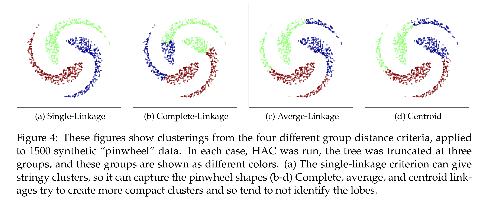

```{r setup, include=FALSE}
knitr::opts_chunk$set(echo = TRUE)
```

## Roadmap

- Problems with microarray data:
    + Normalization (**RMA**)
    + Batch Effect (**ComBat**)
    + Can detect batch effect with **clustering**.
- **LIMMA** to find differentially expressed genes
- **DAVID** to find pathways / gene ontologies that are enriched in
differentially expressed genes---helps you interpret the result.

## Install and Load Packages

```{r bioc, eval = FALSE}
# install packages from bioconductor
source("https://bioconductor.org/biocLite.R") 
biocLite("sva")
biocLite("bladderbatch") # for the example data
# etc.
```

```{r libraries, warning = FALSE, message = FALSE}
library(sva)
library(bladderbatch)
library(limma)
```

## Load Data

- Gene expression data from investigation into bladder cancer.
- Outcome: finding differentially expressed genes that are
associated with cancer status (0/1 in the variable `hasCancer`).
- Already normalized with RMA.

```{r loaddata}
data(bladderdata)
pheno <- pData(bladderEset)
pheno$hasCancer <- as.numeric(pheno$cancer == "Cancer")
edata <- exprs(bladderEset)
```

## Clustering

- Use the `hclust` command.
- Can plot the clustering result with `plot`.
- Question: What type of data does `hclust` accept? Hint: `?hclust`

## Clustering Code

- Question: Why do I need `t` in the code below?

```{r clustering}
# your turn!
dist_mat <- dist(t(edata))
clustering <- hclust(dist_mat, method = "complete")
plot(clustering, labels = pheno$batch)
```

## Linkage Intuition
{ width=100% }

Source: CS 181 course notes by Ryan Adams.

## More Clustering Plots

- Can you produce a plot where the labels are by cancer status `pheno$cancer`?

## More Clustering Plots: Solution

```{r, clustering2}
# your turn!
```

## ComBat

- Perform batch effect adjustment
- Need to specify model matrix: same matrix you use for LIMMA
- Tells ComBat to remove the batch effect but not to remove the
association due to the `hasCancer` variable

```{r combat}
model <- model.matrix(~hasCancer, data = pheno)
combat_edata <- ComBat(dat = edata, batch = pheno$batch, mod = model)
```

## Check Clustering Again

- Can you perform clustering to check whether ComBat removed the batch
effect?

## Check Clustering Again: Solution

```{r combat-clusters}
# your turn!
```

## LIMMA

- Your turn: Run LIMMA on the data obtained after running ComBat.
- Find all the differentially expressed genes with adjusted p-value $<= 0.05$ and at least 2 fold change.
- How many genes did you get? Hint: `dim`.

## LIMMA: Solution

```{r limma}
# your turn!
# save the result in a variable called tophits
```

## DAVID Prep

- Need to paste a list of genes of interest
- I've found the easiest way to do this is to write the row names of the result of `topTable` to a CSV file, open it in Excel, then copy-paste.

```{r david-prep}
#write.csv(row.names(tophits), file = "for_david.csv", row.names = FALSE)
```
