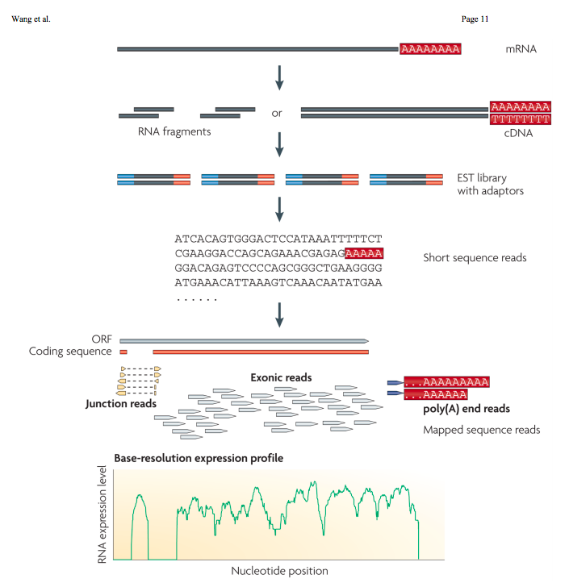

```{r setup, include=FALSE}
knitr::opts_chunk$set(echo = TRUE, fig.align = "center")
```

## Roadmap

- RNA-seq analysis workflow
    - Read alignment
    - Differential expression
- python practice

## Anouncements

- Do not share your code with fellow students via github, please make sure your repo is private.
- Double check you have access to Odyssey and /n/stat115/. You will need it for homework 3 (due 3/4).
- Start early on homework 3! 
- Email me if you did not yet receive a grade for homework 1.

## RNA-seq analysis workflow


## Fragment alignment
- [Star: ultrafast universal RNA-seq aligner](https://academic.oup.com/bioinformatics/article/29/1/15/272537)
    - Suffix array (SA) approach to leverage speed of binary searching
    - Requires an index (the SA) to be created prior to aligning

- [Salmon: fast and bias-aware quantification of transcript expression using dual-phase inference](https://www.ncbi.nlm.nih.gov/pmc/articles/PMC5600148/)
    - Pseudo-alignment concept to rapidly align reads
    - Reads are classified according to their *fragment equivalence class* 
    - (Optionally) removes sequencing biases and computes coverage via likelihood maximization
    - Similar in concept and result to [Near-optimal probabilistic RNA-seq quantification](https://www.nature.com/articles/nbt.3519)
    
## Star alignment
- Needs to be run on Odyssey HPC
- Takes several hours to complete (given an index)
- How do we do that again?

```{r, engine='bash',eval=FALSE}

```

```{r, engine='bash',eval=FALSE}

```

## Salmon alignment
- Much quicker but will still be run on Odyssey
- First step is to create an index, then align

```{r, engine='bash',eval=FALSE}
# shebang and cluster specs here
module load salmon

salmon index -t $TRANSCRIPTOME -i $INDEX

module purge
```

```{r, engine='bash',eval=FALSE}
sbatch createSalmonIndex.sh
```

```{r, engine='bash',eval=FALSE}
# shebang and cluster specs here
module load salmon

salmon quant -i $INDEX \
             -l A \
             -1 $FASTQ/ENCFF500PDO_sub.fastq\
             -2 $FASTQ/ENCFF708KQE_sub.fastq \
             -o $OUT/ \
             --numBootstraps 100 \
             -p 8 \
             --gcBias

module purge
```

```{r, engine='bash',eval=FALSE}
sbatch Salmonalignment.sh
```

## Running your own alignment
- Use the commands given earlier to run your own alignment in Homework 3
- Recall the idea of variables in bash to simplify your code
    - `export VARIABLE=file/path`
- Batch submit your job to the cluster, outputting files to your local folder
- Upon completion, you may receive an email
- View the slurm- file and the log file (located in the output directory)
- Abundance estimates are given in the `.sf` file. Copy these to your local directory (e.g. `scp` or fileZilla) for downstream analysis

## Differential expression
- Given the abundance estimates, we now wish to determine which genes/transcripts are differentially expressed between condition.
- Just like in microarrays, we need to create a design matrix specifying what we wish to estimate
- We will be making use of the `DESeq2` packages. Install this via bioconductor.
```{r, eval=FALSE,message=FALSE}
source("https://bioconductor.org/biocLite.R")
biocLite("DESeq2")
```

## Differential expression
- Load the package.
- Create a data frame with columns as specified below containing the necessary information for the design matrix (sampleName, fileName, condition).
```{r,message=FALSE}
library(DESeq2)
files <- grep("sf",list.files("data"),value=TRUE)

```

## Differential expression
- Utilizing the mouse transcriptome as below, extract the transcript id columns and the gene id columns.
```{r,message=FALSE}
library(EnsDb.Mmusculus.v79)

```

## Differential expression
- Now we're going to import the data and format the data for analysis.
- Remove rows with a total row count less than or equal to 1.
- Run the analysis!
```{r,message=FALSE}
library(tximport)

```

## Differential expression
- Extract the significantly DE genes at the .05 significance level.
- Remove incomplete observations (those with missing column data).
- Find those DE genes significantly up/down regulated with an adjusted p-value below .05. How many are there?
```{r}

```

## Visualizing results
- Which plot should we use to visualize the differential expression? Use it to visualize the results.
- Any other thoughts on how to further visualize the results?
```{r}

```

## python practice

Write a python program to merge two paired-end Fastq files (4OH1_5M_a_sub.fastq;4OH1_5M_b_sub.fastq in /n/stat115/2017/HW2/Homework2/FastqData) in to one. 

The results should look like below:
Sequace ID,sequence a,sequence b,sequence a quality,sequence b 
@SRR2994643.15099964 15099964 length=50, 
CTTTTTTTTTTTTTTTTTTTTTTTTTTTTTTTTTTTTTTTTTTTTTTTTT, 
AAAAAAAAAAAAAAAAAAAAAAAAAAAAAAAAAAAAAAAAAAAAAAAAAA, 
CCCCCGGGGGGGGGGGGGGGGGGGGGGGGGGGGGGGGGGGGGGGGGGGGG, 
BBB@BGGGGGGGGGGGFGGGGGFGGGGGD;?/:9??9/999:9::>9?C?

## Objectives
1)  Read in the two files into python
2)	Distinguish quality ID and quality score, and sequence Id and sequence information
3)	Match the sequence according to their sequence ID
4)	Write out the results in csv files (remember to name your file with .csv suffix so that it can be opened directly by excel)

## Solution steps 
Possible solutions steps:
1)  Define object class to hold read
2)  Define tailored `read` function
3)  Iterate through file 1 matching in file 2
4)  Write results

## Class definitions
- Classes are user-defined objects allowing instances of that object to be created
- We may code up specific methods for the class depending on the particular use case
- Once intialized (default behavior), we may utilize these methods
- Here we want to define a class to store the name, sequence, and quality score, along with a method to format the result

```
class myClass(object):

    def __init__(self, option):
        self.option = option

    def myFunction(self, option2="."):
        self.option = self.option.split(option2)
        return self
```

## Class definitions
- Define a class called Fastq which is initialized with a name, sequence, and quality score slot. 
- Add a trimDetail method which removes the last column of the input row.

```
class Fastq(object):

    def __init__(self, name, seq, qual):
        

    def trimDetail(self, separator=" "):

```

## Function definition
- We saw function definitions in Lab 2
- Write a function called readFastq to open a file in reading mode, strip off each column in the line, and return a Fastq object

```
def readFastq(infile):
    
```

## Main code evaulation
- Now write code to read in the two files in the data folder. To do so, create variables to store the file names, create dictionaries for each file, read the files in with your readFastq function. Lastly, define two booleans: `s1_finished`, `s2_finished` and assign them as false.

```
if __name__ == "__main__":
    import csv
    in1 = '4OH1_5M_a_sub.fastq'
    in2 = '4OH1_5M_b_sub.fastq'
```

## Iterate through the reads
- We now need to iterate the files and collect all the information we need from each. These will be output to csv.
- Write code to check the value of the boolean variables and evaluate while both are still false. At each step, check if a subsequent element in `seq1` exists, and if not, assign a true value to s1_finished. Do the same for `seq2`. If a subsequent element exists, assign the value to `s1`, `s2` respectively.
- If a value was assigned to `s1`, assign it to the `seq1_dict` and name the element `s1.trimDetail()` making use of your defined method from earlier. Do the same for `s2`.

```
      with open(in1 + '.csv', "w") as reads1:
        fieldnames = ['SequenceID', 'SequenceA', 'SequenceB','QualityA','QualityB']
        writer = csv.DictWriter(reads1, fieldnames=fieldnames)
        writer.writeheader()
```

## Write results 
- The last step is to write the results. Code provided below.
- Write code to evaluate if `s1_finished=False` and `s1.trimDetail() in seq2_dict`, and if evaluated writes a row to our output file filling in values for each of the columns defined earlier. `pop` off this added row from each of the dictionaries.
- Do the same (but flip!) for `s2`.

