```{r setup, include=FALSE}
knitr::opts_chunk$set(echo = TRUE, fig.align = "center")
```

## Roadmap

* single-cell RNA-seq
    + Motivation
    + Experimental protocol
    + Quality control
    + Analysis workflow
* Example

## Motivation - Bulk vs single-cell RNA-seq
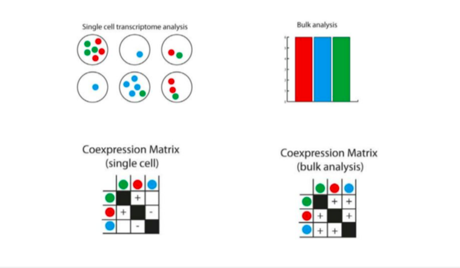

## Motivation - Heterogeneous cell populations
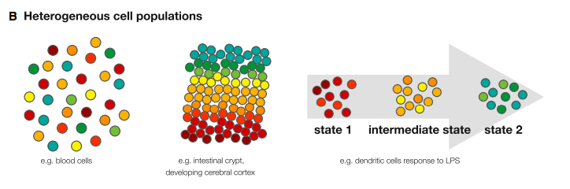

## Motivation - Identification of cell populations
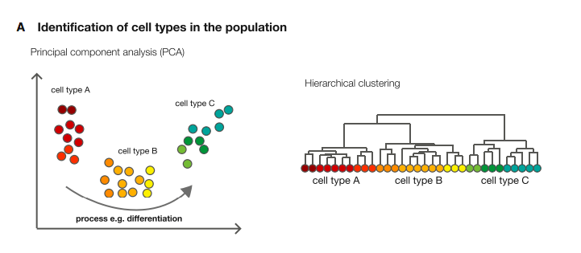

## Motivation - Subpopulation characterization
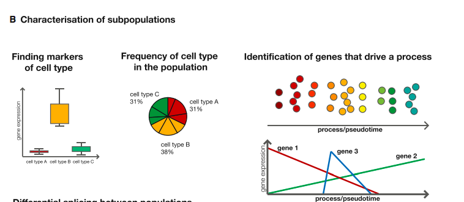

## Motivation - Subpopulation characterization
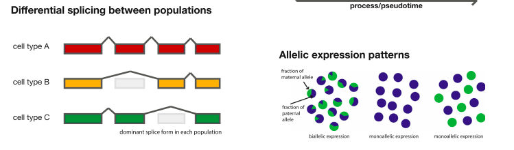

## Experiment setup


## Experimental protocols


## Drop-seq protocol
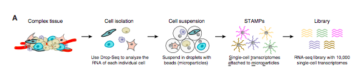

## Drop-seq protocol
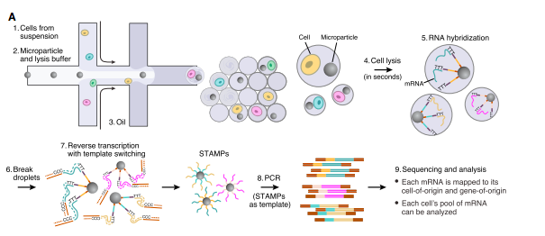

## Summary

* Droplet based (inDrop, Drop-Seq, 10X)
    + Cheaper per cell
    + Can produce more cells per batch
    + Use UMIs (more robust to PCR bias)
* SMART-Seq
    + Full length (splicing analysis)
    + Lower dropout/better detection

## Digital expression matrix
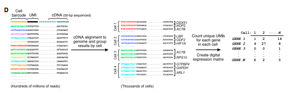

## Protocol comparison
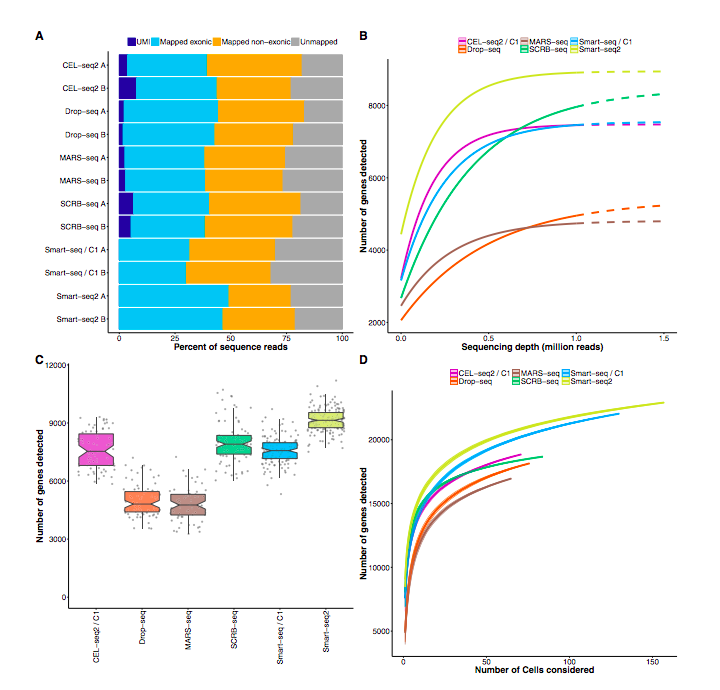

## Quality control steps
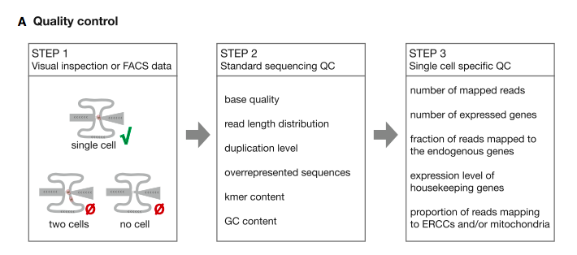

## Quality control - dropout
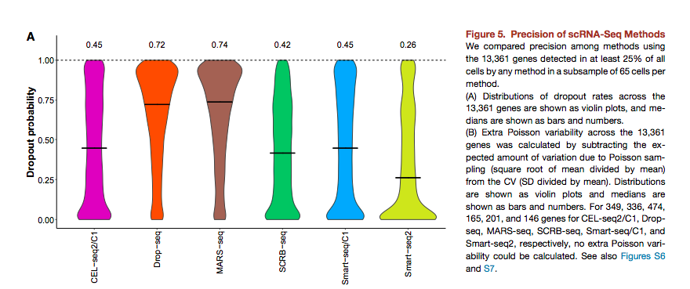

## Quality control - species-mixing experiments
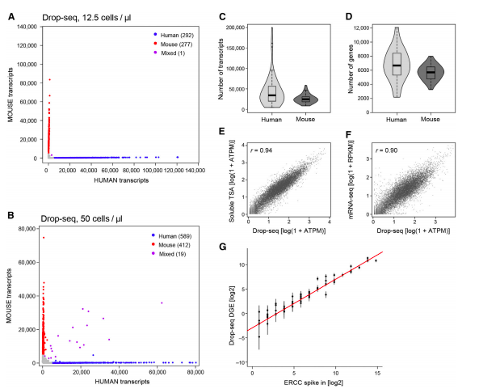

## Analysis workflow - Decomposing variability
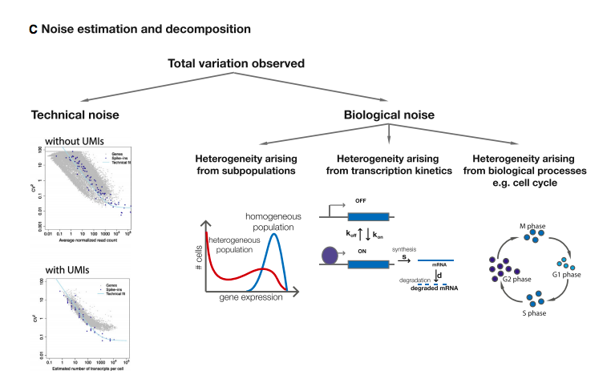

## Analysis workflow - Characterizing cell trajectories
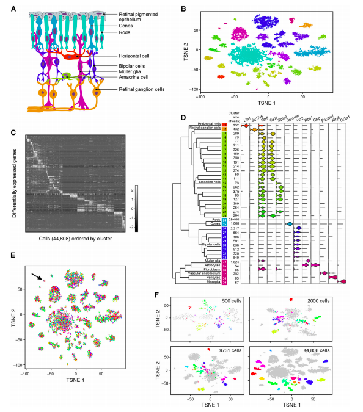

## Analysis workflow
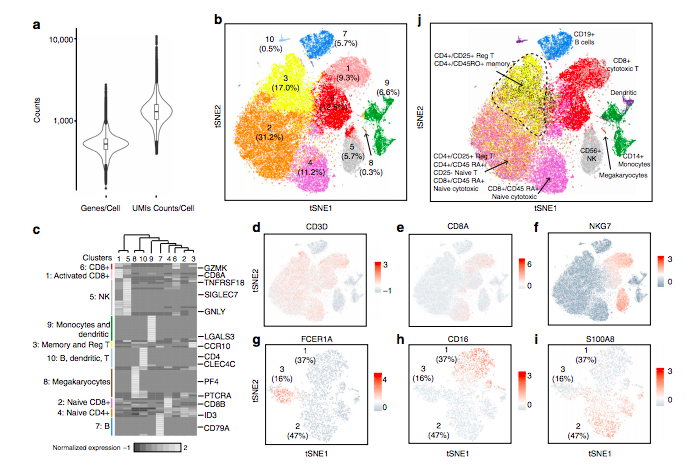

## Analysis workflow


## Data analysis
For this exercise, we will be analyzing the a single cell RNA-Seq dataset of Peripheral Blood Mononuclear Cells (PBMC) from the 10X Genomics platform. We will primarily be using the seurat package from the Satija Lab, which includes a vignette here. http://satijalab.org/seurat/pbmc-tutorial.html. The purpose of single cell RNA-Seq analysis is to uncover interesting biology that occurs at a granularity--the single cell--that isn't appreciated when these features become averaged in bulk. The goal of this analysis is to uncover heterogenity in PBMCs and understanding the analysis workflows for single cell technologies. 

**First, load the packages and the data object**
```{r init, cache=FALSE, message=FALSE,eval=FALSE}
library(Seurat)
library(Matrix)
library(dplyr)

pbmc <- readRDS("data/pbmc.rds")
dim(pbmc@raw.data)
```
*Note:* to achieve this object, the counts matrix had to be determined using a standard alignment protocol similar to bulk RNA-Seq analyses. The **.rds** object contains a **seurat** object with 2001 samples and over 32,000 genes. This sample set includes roughly 1,000 PBMC samples from two different batches.

## Data analysis
The substantial sparsity associated with scRNA-Seq data makes analysis a unique challenge. Use the 'CreateSeurateObject' command to filter lowly expressed genes and weakly detected cells in this raw dataset. How many samples and genes are filtered afterwards?
```{r Filter, cache=TRUE, message=FALSE, warning = FALSE,eval=FALSE}
pbmc <- CreateSeuratObject(raw.data=pbmc@raw.data,min.cells = 3, min.genes = 200,project = "10X_PBMC")
```

## Confounders
When trying to discover rare cell types, one has to be weary of technical confounders that imply heterogenity that are actually false. Two measures of technical confounders are the number of mitochondrial reads mapped as well as the number of unique genes mapped. In this dataset, how many mitochondrial genes are there? What is the distribution of the proportion of reads for these mitochondrial genes? How many samples express a number of genes that significantly deviates from the rest? Remove these.

```{r qc, cache=TRUE, results= 'hide', fig.height=7,fig.width=13,eval=FALSE}
mito.genes <- grep("^MT-", rownames(pbmc@data), value = TRUE)
percent.mito <- colSums(pbmc@data[mito.genes, ])/colSums(pbmc@data)

#AddMetaData adds columns to object@data.info, and is a great place to stash QC stats
pbmc <- AddMetaData(pbmc, percent.mito, "percent.mito")
VlnPlot(pbmc, c("percent.mito"), nCol = 1)
VlnPlot(pbmc, c("nGene", "nUMI", "percent.mito"), nCol = 3)

pbmc <- SubsetData(pbmc, subset.name = "nGene", accept.high = 2500)
pbmc <- SubsetData(pbmc, subset.name = "percent.mito", accept.high = 0.05)
```

## Normalization
Now we can normalize the gene expression measurements for each cell by the total expression, multiply this by a scale factor, and log-transforms the result.
```{r,eval=FALSE}
pbmc <- NormalizeData(object = pbmc, normalization.method = "LogNormalize", scale.factor = 1e4)
```

## Linear/Non-linear dimensional reduction
Rather than focusing on specific differentially expressed genes, a staple in scRNA-Seq analyses involves dimension reduction. Let's start by investigating the mean-variance relationship and discarding outliers. Then we can scale the data and regress out the confounders we looked at earlier. Finally, we'll run PCA. 
```{r meanVar, message = FALSE, warning = FALSE, fig.keep= FALSE,eval=FALSE}
pbmc <- FindVariableGenes(pbmc,mean.function=ExpMean,dispersion.function = LogVMR, x.low.cutoff = 0.0125, x.high.cutoff = 3, y.cutoff = 0.5, do.contour = FALSE)
length(x = pbmc@var.genes)
pbmc <- ScaleData(pbmc,vars.to.regress = c('nUMI','percent.mito'))
pbmc <- RunPCA(pbmc, pc.genes = pbmc@var.genes, do.print = FALSE, pcs.print = 5, genes.print = 5)
```

## Visualization
Seurat provides several useful ways of visualizing both cells and genes that define the PCA, including **PrintPCA()**, **VizPCA()**, **PCAPlot()**, and **PCHeatmap()**

```{r pca_viz, cache=TRUE,eval=FALSE}
# Examine  and visualize PCA results a few different ways
PrintPCA(pbmc, pcs.print = 1:5, genes.print = 5, use.full = FALSE)
VizPCA(pbmc, 1:2)
PCAPlot(pbmc, 1, 2)
```

```{r multi-heatmap,fig.height=12,fig.width=9,cache=TRUE, warning=FALSE,eval=FALSE}
PCHeatmap(pbmc, pc.use = 1:12, cells.use = 500, do.balanced = TRUE,
          label.columns = FALSE, use.full = FALSE)
```

## Visualization
Which principal components are statistically significant? Comment on one or more approaches to determine this.
```{r elbow_plot,fig.height=6,fig.width=10,cache=TRUE,warning=FALSE,eval=FALSE}
PCElbowPlot(pbmc)
```
A more ad hoc method for determining which PCs to use is to look at a plot of the standard deviations of the principle components and draw your cutoff where there is a clear elbow in the graph. This can be done with **PCElbowPlot()**. In this example, it looks like the elbow would fall around PC 9.

## Clustering
Use the FindClusters command to determine sample modules in the PBMC data. Comment on the type of clustering performed. Is it supervised or unsupervised?
```{r cluster,fig.height=5,fig.width=7,cache=TRUE,eval=FALSE}
pbmc <- FindClusters(object = pbmc, reduction.type = "pca", dims.use = 1:10, 
    resolution = 0.6, print.output = 0, save.SNN = TRUE)
```
Details are in the Seurat source code as well as several paragraphs in the vignette. It is supervised. 

## tSNE plot
A popular method for displaying scRNA-Seq data is by creating two dimensions using tSNE. Run and visualize tSNE for this data. Comment on how this approach is different than PCA.

```{r tsne, fig.height=5, fig.width=7, cache=TRUE, message=FALSE, warnings=FALSE,eval=FALSE}
pbmc <- RunTSNE(pbmc, dims.use = 1:10, do.fast = TRUE)
```

```{r tsneplot,fig.height=5,fig.width=7,cache=TRUE,eval=FALSE}
TSNEPlot(pbmc,do.label = TRUE)
```
*Note:* tSNE is, by definition, a stochastic process so be sure to cache your data at this point or save the file image before re-running later steps! 
Main difference is linear/non linear effects; tSNE in this case is using the PCs as input

## Differentially expressed genes (cluster biomarkers)
Now that we've defined data-driven clusters, we'd like to identify markers that define clusters via differential expression. What markers distinguish cluster 2? What markers distinguish cluster 2 from cluster 4? Every cluster from all others.

```{r markers1,fig.height=8,fig.width=15,cache=TRUE, warning=FALSE,eval=FALSE}
# find all markers of cluster 2
cluster2.markers <- FindMarkers(pbmc, ident.1 = 2, min.pct = 0.25)
print(head(cluster2.markers, 5))

cluster24.markers <- FindMarkers(pbmc, 2, 4, min.pct = 0.25)
print(head(cluster24.markers, 5))

pbmc.markers <- FindAllMarkers(pbmc, only.pos = TRUE, min.pct = 0.25, thresh.use = 0.25)
pbmc.markers %>% group_by(cluster) %>% top_n(2, avg_diff)
```

## Differentially expressed genes (cluster biomarkers)
Using the biomarkers identified above, select a few markers to distinguish the various subgroups. Try plotting different measurements, including raw and normalized counts on/not on the log scale.

```{r markerplots,fig.height=8,fig.width=15,cache=TRUE,eval=FALSE}
VlnPlot(pbmc, c("CD74","LDHB"))

VlnPlot(pbmc, c("LST1","PF4"), use.raw = TRUE, y.log = TRUE)
```

## Differentially expressed genes (cluster biomarkers)
Using the table below, identify which clusters correspond to which cell subtypes in your tSNE projection. Do you observe any rare populations or mixed populations? Explore some other markers to characterize the behavior of these populations.

Cluster ID | Markers       | Cell Type
-----------|---------------|----------
?          | IL7R          | CD4 T cells
?          | CD14, LYZ     | CD14+ Monocytes
?          | MS4A1         | B cells
?          | CD8A          | CD8 T cells
?          | FCGR3A, MS4A7 | FCGR3A+ Monocytes
?          | GNLY, NKG7    | NK cells
?          | FCER1A, CST3  | Dendritic Cells
?          | PPBP          | Megakaryocytes


```{r markerplots2,fig.height=8,fig.width=15,cache=TRUE,eval=FALSE}
factors <- c("IL7R", "CD14", "LYZ", "MS4A1", "CD8A",
             "FCGR3A", "MS4A7", "GNLY", "NKG7", "FCER1A", "CST3", "PPBP")
FeaturePlot(pbmc,factors , cols.use = c("grey","blue"))
```

## Differentially expressed genes (cluster biomarkers)
Using the inference above, annotate your tSNE with the cell type names.

```{r labelplot,fig.height=5,fig.width=9,cache=FALSE, warning = FALSE,eval=FALSE}
current.cluster.ids <- c(0, 1, 2, 3, 4, 5, 6, 7)
new.cluster.ids <- c("CD4 T cells", "CD14+ Monocytes", "B cells",
                     "CD8 T cells", "CD4 T cells", "FCGR3A+ Monocytes", "NK cells",
                     "Dendritic cells")
pbmc@ident <- plyr::mapvalues(pbmc@ident, from = current.cluster.ids, to = new.cluster.ids)
TSNEPlot(pbmc, do.label = TRUE, pt.size = 0.5)
```