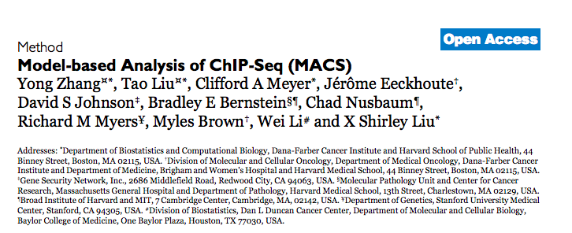
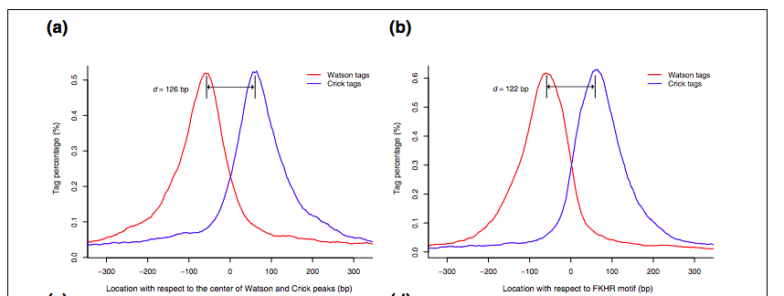
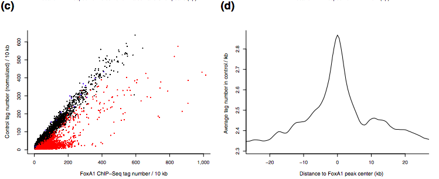
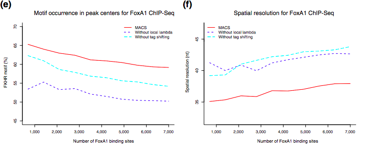

```{r setup, include=FALSE}
knitr::opts_chunk$set(echo = TRUE, fig.align = "center")
```

## Roadmap

* ChIP-Seq
* MACS
* BedTools
    - Example
* UCSC
* python 
    - Example

## ChIP-Seq

* Popular technology to identify binding sites of transcription factors and other DNA-binding proteins
* Requires less starting material, lower cost, higher peak resolution than ChIP-chip
* Reads must be mapped before technology-specific pipelines may be used

## ChIP-Seq


## ChIP-Seq Difficulties

* Tags represent only the ends of ChIP fragments, not the precise location of the DNA-binding protein
    - Shift should be accounted for to improve peak calling
* Exhibits regional biases 
    - Due to sequencing and mapping biases
    - Chromatin structure
    - Copy number variation
    
## ChIP-Seq


## MACS: Overview

* *Model-based analysis of ChIP-Seq (MACS)* 
* Peak calling method to identify genomic binding sites from read count data
* [Documentation](https://github.com/taoliu/MACS)
* Available on Odyssey with `module load macs2/2.1.0.20140616-fasrc01`


## MACS: Overview

* Empirically models the shift size of ChIP-Seq tags
    - Tags  shifted towards the 3' direction
    - Tag density around a true binding site should show a bimodal enrichment pattern
    - Initial scan for high confidence peaks and use these to estimate *d*
    - Shift all tags by *d/2*


## MACS: Overview

* Accounts for regional biases via dynamic parameter estimation
    - Tag distribution modelled with Poisson distribution
    - Estimate $\lambda_{BG}$ from control tags
    - Slide width=$d$ bins across the genome to identify candidate peaks
    - Estimate $\lambda_{1k},\lambda_{15k},\lambda_{10k}$ surrounding each candidate peak
    - Select the maximum $\lambda$ and calculate p-value based on this parameter



## MACS: Overview


## MACS: Pipeline

1. Align reads (Input Fastq output BAM)
2. Remove duplicates (Input BAM output BED)
3. Downsample (balance reads between treatment and control)
4. Call peaks (Input BAM output BED)
5. Visualize peaks (UCSC)
6. Integrate gene expression data (BETA, next week)

## MACS: Remove Duplicates

* Amplification bias introduced during PCR step
* Duplicates removed with maximum number allowed depending on sequencing depth
* The default is no more than one tag per position (remove all redundancies)

```{r,engine='bash',eval=FALSE}
-i Intput file
-g Genome size
--keep-dup Duplicates to keep 
-o Output file

macs2 filterdup -i In.bam -g mm --keep-dup 1 -o Out.bed
```


## MACS: Downsample

* Imbalance in read counts between treatment and control can bias results
* Check which files has more reads (e.g. `wc -l file.BAM`)

```{r,engine='bash',eval=FALSE}
-t Intput file
-n Number to sample 
-o Output file

macs2 randsample -t In.bed -n 10^6 -o Out.bed
```

## MACS: Peak Calling

* Finally, call peaks
* MACS will handle estimating *d*, sliding the tags by *d/2*, and estimating *\lambda*

```{r,engine='bash',eval=FALSE}
-t Treatment file
-c Control file 
-f File format 
-n Output prefix
-m Genome size

macs2 callpeak -t Trt.bed -c Ctrl.bed -f AUTO -g mm -n Out
```

## .Bed File format
* Browser Extensible Data
* Provides a flexible way to define the data lines that are displayed in an annotation track
* [Details on the file format](https://genome.ucsc.edu/FAQ/FAQformat.html#format1)
* 3 required fields
    - Chromosome
    - Start
    - End
* Start position is zero based, and start=n1 to stop=n2 represents the interval (n1 + 1, n2)
* 9 0ptional fields
    – Name
    – Feature score (e.g. p value) 
    – Strand {+, −}

## Bedtools: Overview
* 'Collectively, the bedtools utilities are a swiss-army knife of tools for a wide-range of genomics analysis tasks. The most widely-used tools enable genome arithmetic: that is, set theory on the genome.'
* I.e. implementations of simple operations which may be combined for complex analyses
    -  *Are the same peaks called in two ChIP-Seq experiments?*
* [Documentation](http://bedtools.readthedocs.io/en/latest/)
* Commandline tool however `bedr` R package available
* Many [installation options](http://bedtools.readthedocs.io/en/latest/content/installation.html) (homebrew, macports, etc.)

## Bedtools: Functions
* We will be using data corresponding to blacklist sites from https://sites.google.com/site/anshulkundaje/projects/blacklists.
```{r,eval=FALSE}
# Load bedr
library(bedr)

# Simulate 1e5 inervals all of length 250
rand.reads <- get.random.regions(n=1e5,species='human',build='hg19',size.mean=log(250+1),size.sd=0)

# Now let's grow these up to 500
rand.reads <- grow.region(rand.reads,start.add=125,end.add=125)

# Now let's load the blacklist sites from the data folder
blacklist.sites <- as.data.frame(read.table("data/hg38.blacklist.bed",header = FALSE, sep="\t",stringsAsFactors=FALSE, quote=""))
colnames(blacklist.sites) <- c('chr','start','end')

# And finally subtract any blacklisted sites
rand.reads <- bedr.subtract.region(rand.reads,blacklist.sites)

# Write bed file
write.table(rand.reads,file='data/randomIntervals.bed',row.names = FALSE,col.names=FALSE,quote = FALSE,sep = "\t")

# Get the corresponding nucleotide sequences
rand.reads <- get.fasta(x=rand.reads,fasta="~/Desktop/Research/Vikes/data/genomes/hg19.fa")

# Conver the sequences to upper case. Get the reverse complement
rand.reads$sequence <- toupper(rand.reads$sequence)
rand.reads$sequence.rc <- chartr("ATGC","TACG",rand.reads$sequence)

# Write to output fasta file
write.table(rand.reads,file='data/randomIntervals.fa',row.names = FALSE,col.names=FALSE,quote = FALSE,sep = "\t")
```

## Bedtools: Functions
* Simple example: sorting

```{r,engine='bash',eval=FALSE}
bedtools sort -i data/randomIntervals.bed > data/Sorted.bed
```

## Bedtools: Functions
* And many more command line examples!
```{r,engine='bash',eval=FALSE}
# Find closest genomic interval
bedtools closest -a File1.bed -b File2.bed > Out.txt
# Intersection
bedtools intersect -a File1.bed -b File2.bed > Out.txt
# Annotate File1.bed with coverage by File2.bed
bedtools annotate -i File1.bed -files File2.bed > Out.txt
# Convert File1.bam to File1.bed
bedtools bamtobed -i File1.bam > File1.bed
# To generate random intervals from a genome:
bedtools random -n 10^6 -g human.hg19.genome > Out.bed
# Shuffle locations of genomic intervals:
bedtools shuffle -i File1.bed -g human.hg19.genome > Out.bed
```

## UCSC: Overview
* [UCSC Genome Browser](https://genome.ucsc.edu/)
* Tool for visualizing genomic intervals
* Select relevant genome (species and assembly)
* Search for genes or genomic loci
* Upload intervals from bed file using add custom tracks

## python

* We will be using the bed file you randomly generated in the last part. These intervals will be the true regions and will be considered positive outcomes ($Y=1$). We will then generate negative cases by shuffling the positives while maintaining di-nucleotide content (i.e. all 2-mer frequencies maintained). Next lab we'll try to see what we can learn about the motifs within sequences!

1. Read in the genomic intervals line by line and for each one generate a di-nucleotide shuffled version of the sequence.
2. Write the results to an output file.
3. Generalize your code so that it may be used as a function. Add command line arguments such that you may call it directly from the command line.
4. Try it out! 
