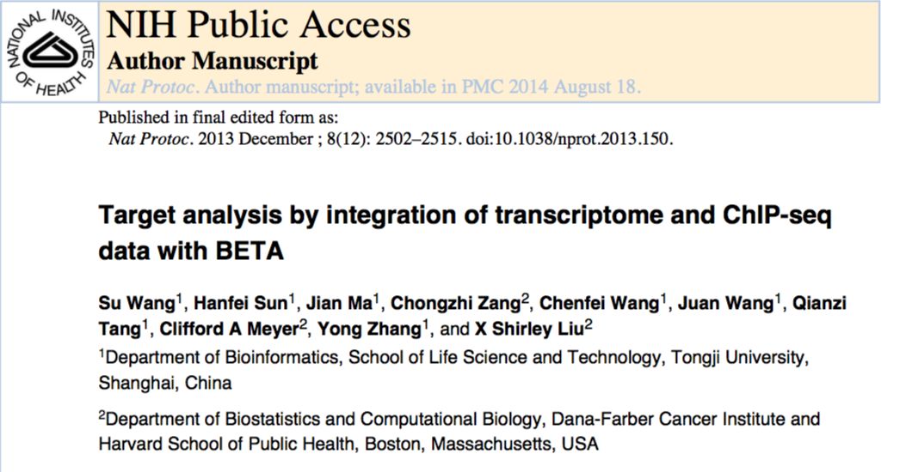
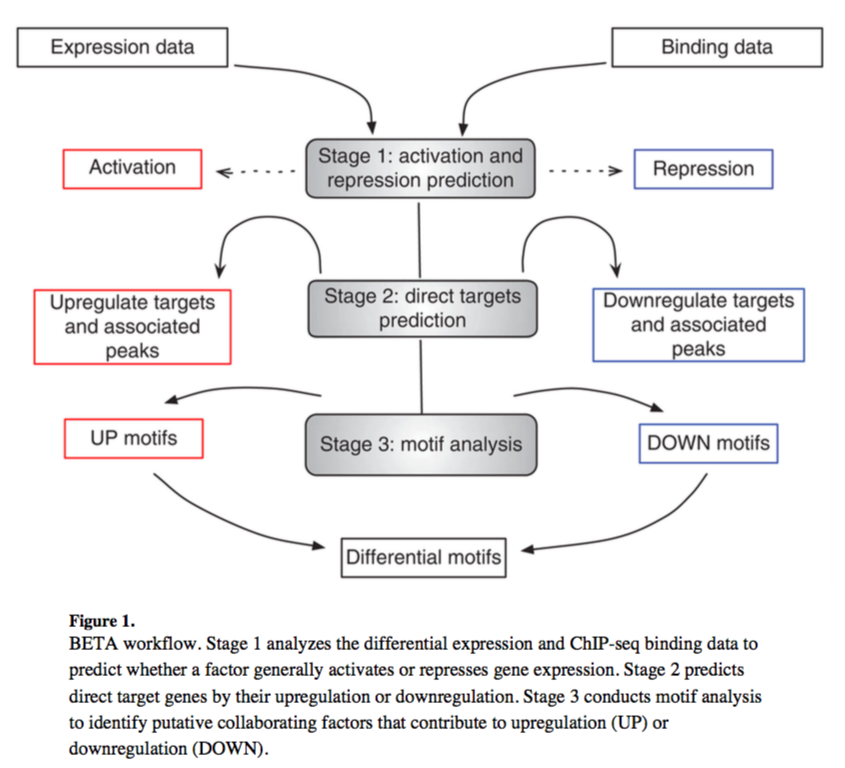
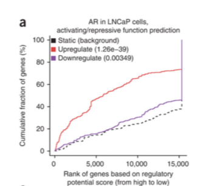
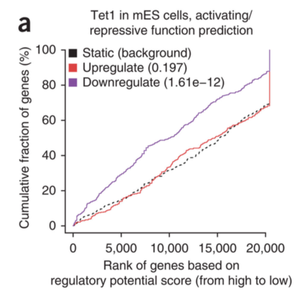
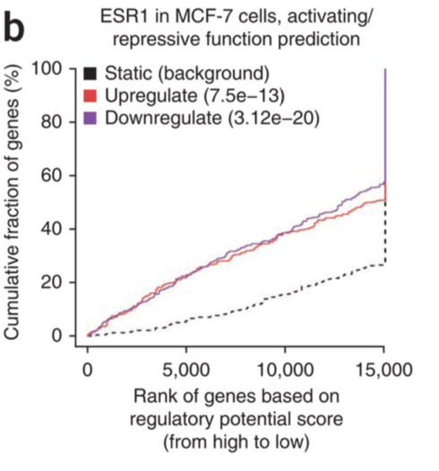
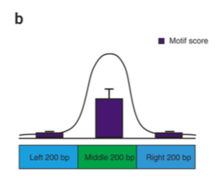
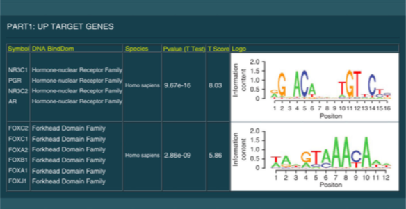
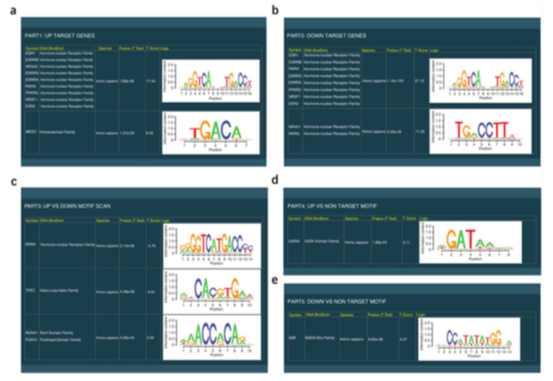

```{r setup, include=FALSE}
knitr::opts_chunk$set(echo = TRUE, fig.align = "center")
```

## Roadmap

* BETA
    - Overview
    - Example
* python 
    - Example
    
## Motivation

* Given peaks called from ChIP-seq, we are interested in assessing which genes are regulated by the given factor (TFs or chromatin regulators)
    - I.e. *Target genes*

* A simple method would be to assign the nearest gene or the gene containing peaks in its promoter region

* But ChIP-seq experiments are often examined in the context of gene expression, and thus expression profiles are available for both the factor-bound and factor-unbound conditions

* So how can this information be incorporated with the peaks to improve inference about target genes?

## Binding and expression target analysis (BETA)

* Software package to analyze factor binding and differential expression in mammalian genomes
    - Paper: https://www.nature.com/articles/nprot.2013.150
    - Source code: http://cistrome.org/BETA 
    - Web tool: http://cistrome.org/ap/
    _ Note we will be using the web tool for the homework, no need to download the source code!



## BETA overview

* Incorporates differential expression and ChIP-seq peaks

1. Call genes up-/down-regulated (LIMMA)
    - Also save a list of non-DE genes
2. Call peaks (MACS)
3. Combine to infer (BETA):
    - Whether factor has activating/repressive function
    - Identify direct target genes
    - Identify binding motif and collaborators (Beta-plus)

## BETA overview



## Case Study (from BETA Nature Protocols paper)

* Androgen receptor (AR) ChIP-chip data obtained in LNCaP cells 

* Combined with microarray data of gene expression after 16 h of dihydrotestosterone (DHT) treatment

* AR is a member of the nuclear receptor family
    - Gene regulator in normal prostate and in prostate cancer
    
* Detection of AR target genes is important to understand its regulation and function

## BETA workflow

1. Use LIMMA to detect up-/down-DE genes (CSV file)

2. Output genes in three categories (up-regulated,down-regulated,unchanged)
    - May need to use a more stringent cutoff if too many genes
    
3. Binding events/peaks called from MACS (BED file)

## Activating/repressive function prediction

4. For each gene in the CSV files, estimate its regulatory potential
    - *The likelihood the gene is regulated by the TF*
    - Scored *per gene* as the sum of the *contribution of individual binding sites* within a user-defined distance
    - The contribution of each site is modelled by a monotonically decreasing function based on the distance between the binding site and transcription start site
    - $S_g = \sum_{i=1}^k e^{-(.5 + 4 \delta_i)}$ where $\delta_i$ is the distance from above divided by 100KB
    
5. By category (up,down,unchanged), rank the genes by decreasing score

6. Calculate cumulative distribution function of the gene groups

7. Use a one-tailed Kolmogorov-Smirnov test to determine whether the groups differ significantly from the unchanged group

## Activating/repressive function prediction



## Activating/repressive function prediction

* But how to interpret this graph? 

* Is AR an activator or repressor? Or both?

* Need to recall the experimental design...

## Interpretation

* Clear that the UP-regulated genes have a much higher regulatory potential score than the DOWN-regulated and the nonregulated genes

* *The genes with a gain in gene expression after 16 h of DHT treatment tend to also have an enrichment of AR-binding sites*

* DHT treatment -> more AR activated -> up-regulated genes enriched in binding sites -> AR = Activator!

## Practice: Tet1 in mouse ES cells



## Practice: ESR1 in MCF-7 cells



## Direct target prediction

8. Sort and assign ranks to peaks based on regulatory potential

9. Sort and assign ranks to genes based on differential expression

10. Compute rank product (interpreted as a p-value).

11. Results are output as a table. Threshold based on score/p-value for confident target genes

## Binding motif analysis

* BETA conducts motif analysis on sites proximal to the targets to identify factor-binding motifs

* Compares the number of motifs near the ChIP-seq binding summits with that in flanking regions to detect motifs with marked summit enrichment

* Results summarized in a web page (screenshot for homework!)



## Binding motif analysis



## Binding motif analysis



## Post-BETA analysis

* Gene ontology of gene list (DAVID, separate by up-/down-regulated)

* Motif analysis

* Co-factor analysis (Intersect the BETA list with the original DE list)

## BETA software summary

* BETA-basic, BETA-plus and BETA-minus

* BETA-basic can be used to predict whether a factor has activating or repressive function and detect direct target genes

* BETA-plus can be used to predict whether a factor has activating or repressive function, whether it can detect direct target genes and whether it can analyze sequence motifs in target regions

* BETA-minus is used when only binding data are available to predict target genes based on distance

* Both binding and differential expression data are required for BETA-basic and BETA-plus

## python example

* Read in the chr8_1M.fa file availabile in the data folder and append all valid nucleotides to a single string

* Compute the di-nucleotide frequencies (i.e. the transition probabilities)

* Use a markov chain to simulate 100 new sequences

* Visualize the information content of the sequences with seqlogo

## python example

```{r, eval=FALSE,engine='python'}
# Read in file and append all nucleotides to a single string
file_in = 'chr8_1M.fa'
seqs = ''
with open(file_in) as f:
    for line_num, line in enumerate(f):
      if 'N' in line or 'chr' in line:
        continue
      seqs += line.upper().rstrip()
      
## Calculate the frequency of each dinucleotide pattern (i.e. transition probability)
from __future__ import division # for non-integer division
dinucleotide_dictionary = {'AA':0, 'AC':0,'AG':0,'AT':0,'CA':0,'CC':0,'CG':0,'CT':0,'GA':0,'GC':0,'GG':0,'GT':0,'TA':0,'TC':0,'TG':0,'TT':0}
for nucleotide in range(len(seqs)-1):
  curr_pair = seqs[nucleotide] + seqs[nucleotide+1]
  dinucleotide_dictionary[curr_pair] += 1
curr_total = sum(dinucleotide_dictionary.values())
dinucleotide_dictionary.update((x, y/curr_total) for x, y in dinucleotide_dictionary.items())

## Or set these manually
#dinucleotide_dictionary = {'AA':.25, 'AC':0,'AG':0,'AT':0,'CA':.25,'CC':0,'CG':0,'CT':0,'GA':.25,'GC':0,'GG':0,'GT':0,'TA':.25,'TC':0,'TG':0,'TT':0}

# Markov chain sequence simulation
import numpy as np # for random choice
n_seqs = 100
seq_lengths = 8
seq_array = list()
dinucleotides = dinucleotide_dictionary.keys()
probs = dinucleotide_dictionary.values()
for i in range(n_seqs):
  seq = np.random.choice(dinucleotides, 1, p=probs)[0]
  for j in range(seq_lengths-2):
    curr_state = seq[-1]
    idx = np.array([x[0] for x in dinucleotides])==curr_state
    possible_new_states = np.array(dinucleotides)[idx]
    possible_new_states = [x[1] for x in possible_new_states]
    transition_prob = np.array(probs)[idx]
    transition_prob = transition_prob/sum(transition_prob)
    new_state = np.random.choice(possible_new_states,1,p=transition_prob)[0]
    seq += new_state
  seq_array.append(seq)
  
# Visualize sequences
from Bio import motifs # for sequence/motif visualization
from Bio.Alphabet import IUPAC  
sequences_f=motifs.create(seq_array,alphabet=IUPAC.ambiguous_dna)
sequences_f.weblogo('seqLogo.png',format="png_print", stack_width="large", color_scheme="color_classic", show_errorbars=False, scale_width=False)
```

